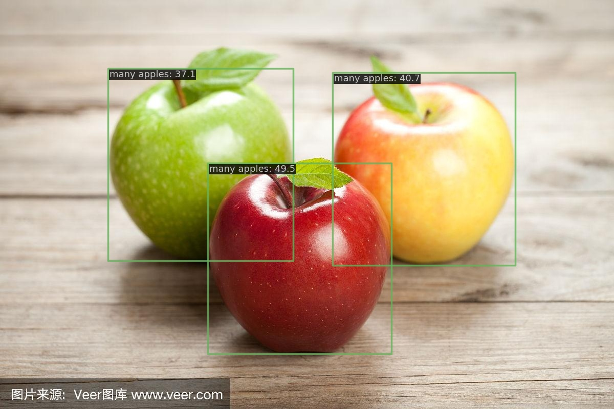
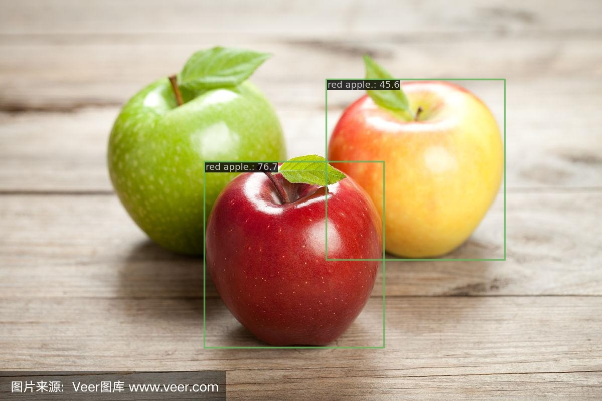

## LLMDet: Learning Strong Open-Vocabulary Object Detectors under the Supervision of Large Language Models

This is the official PyTorch implementation of [LLMDet](https://arxiv.org/abs/2501.18954).

🎉🎉🎉 Our paper is accepted by CVPR 2025 as a highlight paper✨, congratulations and many thanks to the co-authors!

If you find our work helpful, please kindly give us a star🌟

### Updates

- **[2025.06.06]** Added [Gradio demo](https://huggingface.co/spaces/mrdbourke/LLMDet-demo) to Hugging Face, you can now try out LLMDet in your browser.
- **[2025.04.07]** Update demo in huggingface. Release huggingface checkpoints.
- **[2025.04.04]** Our paper was selected as a highlight paper in CVPR2025.
- **[2025.03.25]** Update demo in mmdet.
- **[2025.02.27]** Our paper was accepted by CVPR2025.
- **[2025.01.31]** Release the code and paper.

### 1 Introduction


Recent open-vocabulary detectors achieve promising performance with abundant region-level annotated data. In this work, we show that an open-vocabulary detector co-training with a large language model by generating image-level detailed captions for each image can further improve performance. To achieve the goal, we first collect a dataset, GroundingCap-1M, wherein each image is accompanied by associated grounding labels and an image-level detailed caption. With this dataset, we finetune an open-vocabulary detector with training objectives including a standard grounding loss and a caption generation loss. We take advantage of a large language model to generate both region-level short captions for each region of interest and image-level long captions for the whole image. Under the supervision of the large language model, the resulting detector, LLMDet, outperforms the baseline by a clear margin, enjoying superior open-vocabulary ability. Further, we show that the improved LLMDet can in turn build a stronger large multi-modal model, achieving mutual benefits.

### 2 Model Zoo

| Model                         | AP<sup>mini</sup> | AP<sub>r</sub> | AP<sub>c</sub> | AP<sub>f</sub> | AP<sup>val</sup> | AP<sub>r</sub> | AP<sub>c</sub> | AP<sub>f</sub> |
| ----------------------------- | ----------------- | -------------- | -------------- | -------------- | ---------------- | -------------- | -------------- | -------------- |
| LLMDet Swin-T only p5         | 44.5              | 38.6           | 39.3           | 50.3           | 34.6             | 25.5           | 29.9           | 43.8           |
| LLMDet Swin-T                 | 44.7              | 37.3           | 39.5           | 50.7           | 34.9             | 26.0           | 30.1           | 44.3           |
| LLMDet Swin-B                 | 48.3              | 40.8           | 43.1           | 54.3           | 38.5             | 28.2           | 34.3           | 47.8           |
| LLMDet Swin-L                 | 51.1              | 45.1           | 46.1           | 56.6           | 42.0             | 31.6           | 38.8           | 50.2           |
| LLMDet Swin-L (chunk size 80) | 52.4              | 44.3           | 48.8           | 57.1           | 43.2             | 32.8           | 40.5           | 50.8           |

**NOTE:**

1. AP<sup>mini</sup>: evaluated on LVIS `minival`.
2. AP<sup>val</sup>: evaluated on LVIS `val 1.0`.
3. AP is fixed AP.
4. All the checkpoints and logs can be found in [huggingface](https://huggingface.co/fushh7/LLMDet) and [modelscope](https://modelscope.cn/models/fushh7/LLMDet).
5. Other benchmarks are tested using `LLMDet Swin-T only p5`.

### 3 Our Experiment Environment

Note: other environments may also work.

- pytorch==2.2.1+cu121
- transformers==4.37.2
- numpy==1.22.2 (numpy should be lower than 1.24, recommend for numpy==1.23 or 1.22)
- mmcv==2.2.0, mmengine==0.10.5
- timm, deepspeed, pycocotools, lvis, jsonlines, fairscale, nltk, peft, wandb

### 4 Data Preparation

```
｜--huggingface
｜  |--bert-base-uncased
｜  |--siglip-so400m-patch14-384
｜  |--my_llava-onevision-qwen2-0.5b-ov-2
｜  |--mm_grounding_dino
｜  |  |--grounding_dino_swin-t_pretrain_obj365_goldg_grit9m_v3det_20231204_095047-b448804b.pth
｜  |  |--grounding_dino_swin-b_pretrain_obj365_goldg_v3de-f83eef00.pth
｜  |  |--grounding_dino_swin-l_pretrain_obj365_goldg-34dcdc53.pth
｜--grounding_data
｜  |--coco
｜  |  |--annotations
｜  |  |  |--instances_train2017_vg_merged6.jsonl
｜  |  |  |--instances_val2017.json
｜  |  |  |--lvis_v1_minival_inserted_image_name.json
｜  |  |  |--lvis_od_val.json
｜  |  |--train2017
｜  |  |--val2017
｜  |--flickr30k_entities
｜  |  |--flickr_train_vg7.jsonl
｜  |  |--flickr30k_images
｜  |--gqa
｜  |  |--gqa_train_vg7.jsonl
｜  |  |--images
｜  |--llava_cap
｜  |  |--LLaVA-ReCap-558K_tag_box_vg7.jsonl
｜  |  |--images
｜  |--v3det
｜  |  |--annotations
｜  |  |  |--v3det_2023_v1_train_vg7.jsonl
｜  |  |--images
｜--LLMDet (code)
```

- pretrained models
  - `bert-base-uncased`, `siglip-so400m-patch14-384` are directly downloaded from huggingface.
  - To fully reproduce our results, please download `my_llava-onevision-qwen2-0.5b-ov-2` from [huggingface](https://huggingface.co/fushh7/LLMDet) or [modelscope](https://modelscope.cn/models/fushh7/LLMDet), which is slightly fine-tuned by us in early exploration. We find that the original `llava-onevision-qwen2-0.5b-ov` is still OK to reproduce our results but users should pretrain the projector.
  - Since LLMDet is fine-tuned from`mm_grounding_dino`, please download their checkpoints [swin-t](https://download.openmmlab.com/mmdetection/v3.0/mm_grounding_dino/grounding_dino_swin-t_pretrain_obj365_goldg_grit9m_v3det/grounding_dino_swin-t_pretrain_obj365_goldg_grit9m_v3det_20231204_095047-b448804b.pth), [swin-b](https://download.openmmlab.com/mmdetection/v3.0/mm_grounding_dino/grounding_dino_swin-b_pretrain_obj365_goldg_v3det/grounding_dino_swin-b_pretrain_obj365_goldg_v3de-f83eef00.pth), [swin-l](https://download.openmmlab.com/mmdetection/v3.0/mm_grounding_dino/grounding_dino_swin-l_pretrain_obj365_goldg/grounding_dino_swin-l_pretrain_obj365_goldg-34dcdc53.pth) for training.
- grounding data (GroundingCap-1M)
  - `coco`: You can download it from the [COCO](https://cocodataset.org/) official website or from [opendatalab](https://opendatalab.com/OpenDataLab/COCO_2017).
  - `lvis`: LVIS shares the same images with COCO. You can download the minival annotation file from [here](https://huggingface.co/GLIPModel/GLIP/blob/main/lvis_v1_minival_inserted_image_name.json), and the val 1.0 annotation file from [here](https://huggingface.co/GLIPModel/GLIP/blob/main/lvis_od_val.json). 
  - `flickr30k_entities`：[Flickr30k images](http://shannon.cs.illinois.edu/DenotationGraph/).
  - `gqa`： [GQA images](https://nlp.stanford.edu/data/gqa/images.zip).
  - `llava_cap`：[images](https://huggingface.co/datasets/liuhaotian/LLaVA-Pretrain/blob/main/images.zip) .
  - `v3det`：The V3Det dataset can be downloaded from [opendatalab](https://opendatalab.com/V3Det/V3Det). 
  - Our generated jsonls can be found in [huggingface](https://huggingface.co/fushh7/LLMDet) or [modelscope](https://modelscope.cn/models/fushh7/LLMDet).
  - For other evalation datasets, please refer to [MM-GDINO](https://github.com/open-mmlab/mmdetection/blob/main/configs/mm_grounding_dino/dataset_prepare.md).

### 5 Usage

#### 5.1 Training

```
bash dist_train.sh configs/grounding_dino_swin_t.py 8 --amp
```

#### 5.2 Evaluation

```
bash dist_test.sh configs/grounding_dino_swin_t.py tiny.pth 8
```

#### 5.3 Demo

```
import nltk
nltk.download('punkt')
nltk.download('averaged_perceptron_tagger')
nltk.download('punkt_tab')
nltk.download('averaged_perceptron_tagger_eng')
nltk.download('stopwords')
```

- For Phrase Grounding and Referential Expression Comprehension, users should first download `nltk` packages.
- If you do not want to load the llm during inference, please modify the config `lmm=None`.

1. Open-Vocabuary Object Detection (开放词汇目标检测)

```
python image_demo.py images/demo.jpeg \
  configs/grounding_dino_swin_t.py --weight tiny.pth \
  --text 'apple .' -c --pred-score-thr 0.4
```

<div align=center>

</div>

2. Phrase Grounding (短语定位)

```
python image_demo.py images/demo.jpeg \
  configs/grounding_dino_swin_t.py --weight tiny.pth \
  --text 'There are many apples here.' --pred-score-thr 0.35
```

<div align=center>

</div>

3. Referential Expression Comprehension (指代性表达式理解)

```
python image_demo.py images/demo.jpeg \
  configs/grounding_dino_swin_t.py --weight tiny.pth \
  --text 'red apple.' --tokens-positive -1 --pred-score-thr 0.4
```

<div align=center>

</div>

#### 5.4 Use LLMDet in Huggingface

- Please refer to [hf_readme](https://github.com/iSEE-Laboratory/LLMDet/tree/main/hf_model).

### 6 License

LLMDet is released under the Apache 2.0 license. Please see the LICENSE file for more information.

### 7 Bibtex

If you find our work helpful for your research, please consider citing our paper.

```
@article{fu2025llmdet,
  title={LLMDet: Learning Strong Open-Vocabulary Object Detectors under the Supervision of Large Language Models},
  author={Fu, Shenghao and Yang, Qize and Mo, Qijie and Yan, Junkai and Wei, Xihan and Meng, Jingke and Xie, Xiaohua and Zheng, Wei-Shi},
  journal={arXiv preprint arXiv:2501.18954},
  year={2025}
}
```

### 8 Acknowledgement

Our LLMDet is heavily inspired by many outstanding prior works, including

- [MM-Grounding-DINO](https://github.com/open-mmlab/mmdetection/tree/main/configs/mm_grounding_dino)
- [LLaVA1.5](https://github.com/haotian-liu/LLaVA)
- [LLaVA OneVision](https://github.com/LLaVA-VL/LLaVA-NeXT)
- [ShareGPT4V](https://github.com/ShareGPT4Omni/ShareGPT4V)
- [ASv2](https://github.com/OpenGVLab/all-seeing)
- [RAM](https://github.com/xinyu1205/recognize-anything)

Thank the authors of above projects for open-sourcing their assets!
